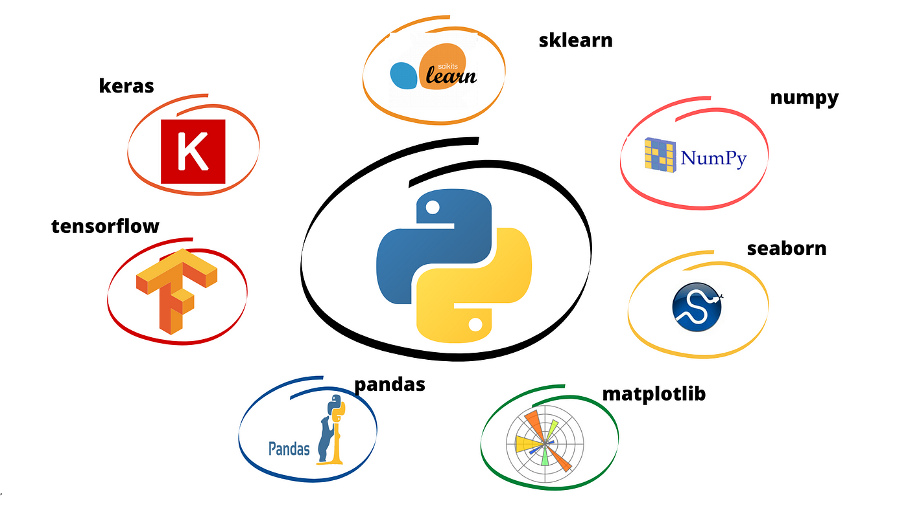

# 
 Srinath Tummala 

<!---

-->

## 👋 Hey there! 👨‍💻

I am a junior data scientist with over one year of experience in the data science domain. My journey in the world of data science has been an exciting learning curve, where I have honed my skills in data analysis, machine learning, and problem-solving. Throughout my projects, I have tackled real-world challenges, from data wrangling to model deployment. I am passionate about leveraging data to make informed decisions and am always up for diving into new and complex datasets.

## 🌱 My Journey
My data science journey has been a multifaceted exploration, where each project has added a layer to my expertise. From developing predictive models to deploying solutions, I've honed a diverse set of skills.

## 🔍 What I Do
- **Data Analysis:** Extracting meaningful insights from raw datasets using statistical methods and visualization tools.
- **Machine Learning:** Designing and implementing machine learning models for predictive analysis and classification tasks.
- **Data Wrangling:** Cleaning and transforming messy data into a usable format, ensuring accuracy and reliability.
- **Model Deployment:** Taking models from development to production, ensuring seamless integration for real-world applications.
- **Feature Engineering:** Crafting relevant features to enhance model performance and accuracy.
- **Exploratory Data Analysis (EDA):** Digging deep into data patterns, trends, and outliers to inform decision-making.
- **Statistical Modeling:** Applying statistical techniques to understand relationships within data and make data-driven decisions.
- **Collaboration:** Working seamlessly in cross-functional teams, fostering communication between technical and non-technical stakeholders.

## 💡 What Drives Me
I'm driven by the belief that data has the power to revolutionize decision-making. The process of transforming raw data into actionable intelligence is not just my job; it's my passion.

## 🌐 Let's Connect!
- Email [Email](srinathtummala7@gmail.com)
- Connect with me on [LinkedIn](https://www.linkedin.com/in/srinath-tummala/)
- Explore my projects on [GitHub](https://github.com/SrinathTummala)

## 💼 Open to Opportunities
Currently seeking opportunities to contribute to impactful projects and collaborate with like-minded individuals in the data science community.

Let's talk data, code, or anything in between! Feel free to reach out. 📊💻
